

  <a href="https://github.com/unchase/awesome-russian-design-systems">
    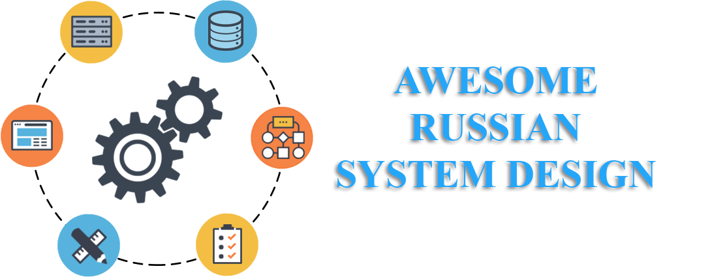
  </a>

---

<h5 align="center">Здесь собран список отечественных и русскоязычных дизайн-систем, а также дополнительных материалов, связанных с ними.</h5>

---

##  [Альфа-Банк](https://alfabank.ru/)

**Название ДС:** [Feather](https://design.alfabank.ru/) - Дизайн-команда одного из ведущих банков

:book: **Дополнительные ссылки и материалы:** 
1.  [arui-feather](https://github.com/alfa-laboratory/arui-feather) - библиотека компонентов
1.  [Цифровые продукты Альфа-Банка](https://digital.alfabank.ru/designsystem)
1.  [LBMM #4 - Я. Саверин, В. Галахов, Собственная система прототипирования на основе веб-компонентов](https://www.youtube.com/watch?v=2Mp6DD-gUjU)
1.  [Дизайн-команда Альфа-Банк, внутренние и внешние проекты – Настя Попова (maildesignfriends)](https://www.youtube.com/watch?v=n8WggChqu0s)
1.  [Тёмная сторона дизайн-системы и что с ней делать](https://habr.com/ru/company/alfa/blog/492010/)
1.  [Бренд-команда Альфа-банка](https://www.youtube.com/watch?v=UuOU_dI0Ne0)

---

##  [АО «БАРС Груп»](https://bars.group/)

[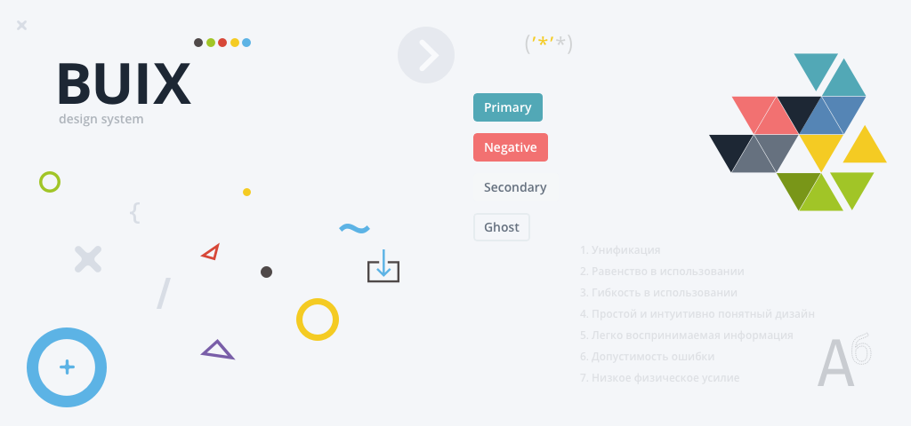](https://design.bars.group/)

**Название ДС:** [BIUX](https://design.bars.group/) - Дизайн-команда крупного федерального разработчика работает над унификацией продуктов для государства и бизнеса

:book: **Дополнительные ссылки и материалы:**
1.  [Разработка своей дизайн-системы. Опыт «БАРС Груп»](https://vc.ru/design/58924-razrabotka-svoey-dizayn-sistemy-opyt-bars-grup)

---

##  [ВКонтакте](https://vk.com)

[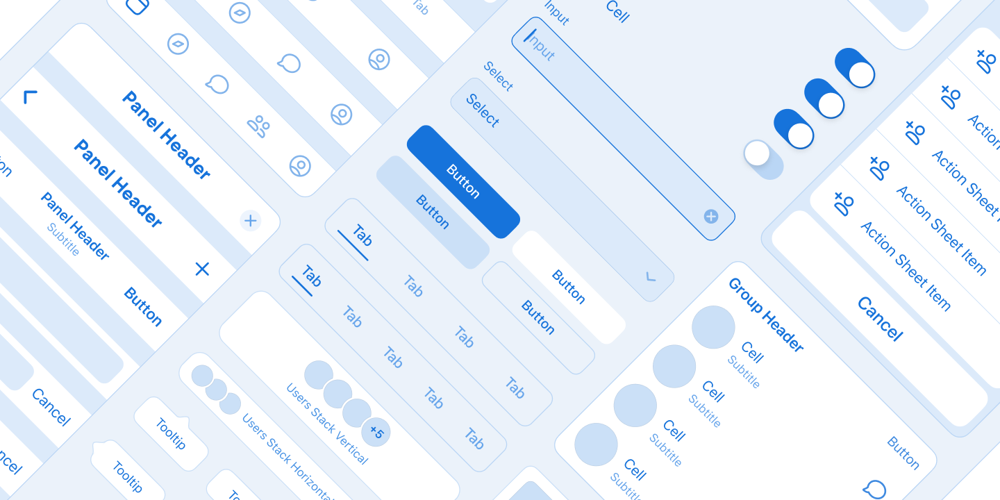](https://www.figma.com/@vk)

**Название ДС:** [Ссылка](https://www.figma.com/@vk) - Крупнейшая отечественная социальная сеть

:book: **Дополнительные ссылки и материалы:**
1.  [VKUI](https://github.com/VKCOM/VKUI) - библиотека компонентов ([Сайт](https://vkcom.github.io/VKUI))
1.  [Публикуем дизайн-библиотеки компонентов VKUI в Figma](https://habr.com/ru/company/vk/blog/501934/)
1.  [Как оседлать радугу: история создания тёмной темы](https://habr.com/ru/company/vk/blog/449720/)

---

## Дизайн Государственных Систем

[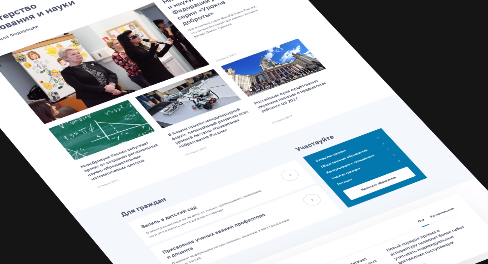](http://gov.design/)

**Название ДС:** [Ссылка](http://gov.design/) - Единая платформа для сайтов государственных органов и учреждений

:book: **Дополнительные ссылки и материалы:**
1.  [govdesign](https://github.com/govdesign)
1.  [Дмитрий Игошин — Дизайн-система России](https://www.facebook.com/watch/?v=1248753351897076)
1.  [Дизайн-стандарт.](https://www.youtube.com/watch?v=Yylbpzy7JHI)

---

##  [Контур](https://kontur.ru/)

[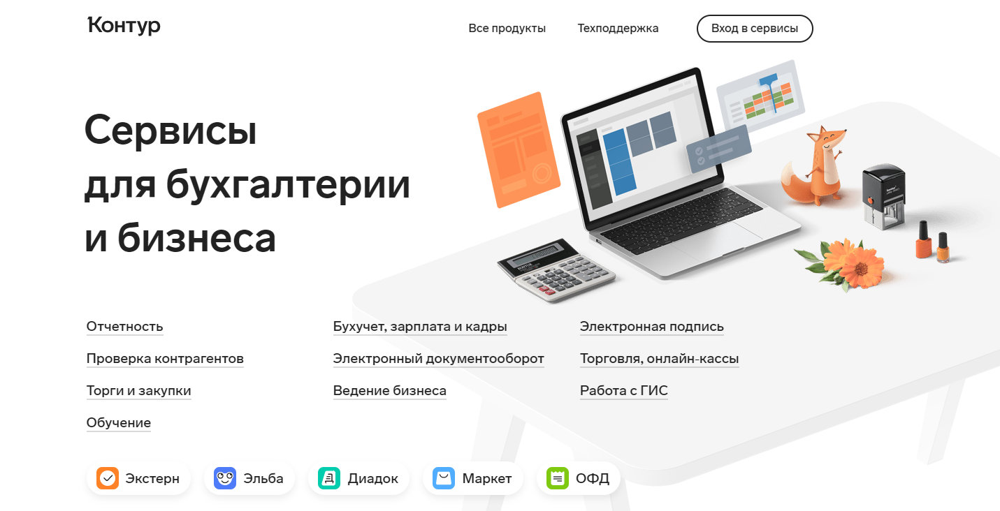](https://guides.kontur.ru/)

**Название ДС:** [КонтурГайды](https://guides.kontur.ru/) - Отечественная онлайн-бухгалтерия

:book: **Дополнительные ссылки и материалы:**
1.  [React UI](https://github.com/skbkontur/retail-ui) - библиотека компонентов
1. [Библиотека ReactUI](https://tech.skbkontur.ru/react-ui/)
1. [Продуктовый дизайн в Контуре](https://tech.kontur.ru/design)
1.  [Скетч-библиотека для работы](https://medium.com/designkontur/скетч-библиотека-для-работы-19a692ea959f)
1.  [Владимир Дзех, Дизайн-система тридцати продуктов для бизнеса](https://www.youtube.com/watch?v=g6LJkJmBG6M)
1.  [Как мы в Контуре меняли фирменный стиль](https://vc.ru/design/255451-kak-my-v-konture-menyali-firmennyy-stil)

---

##  [Мегафон](http://megafon.ru/)

[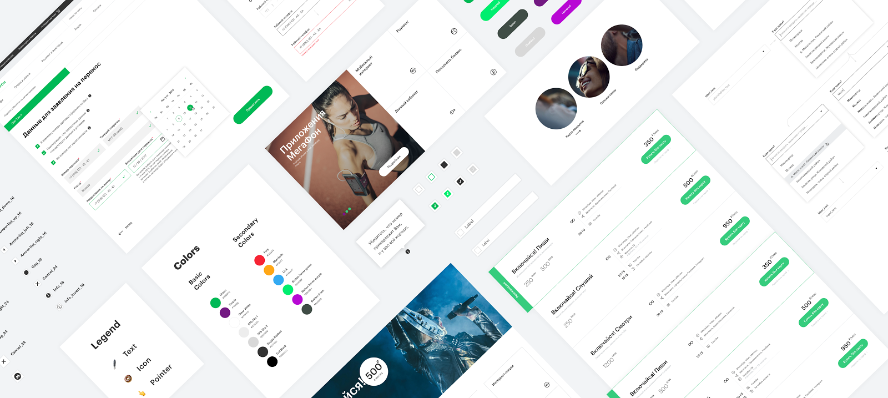](https://ui.megafon.ru/EqR2rxoML8/)

**Название ДС:** [MegaFon React UI](https://ui.megafon.ru/EqR2rxoML8/)

:book: **Дополнительные ссылки и материалы:**
1.  [MegaFon React UI](https://github.com/MegafonWebLab/megafon-ui) - библиотека компонентов
1.  [Дизайн-система МегаФона. Эпизод 1: Процессы и инструменты](https://medium.com/@ux.ui.megafon/дизайн-система-мегафона-эпизод-1-процессы-и-инструменты-ab6970d58483)

---

##  [МТС](https://mts.ru/)

[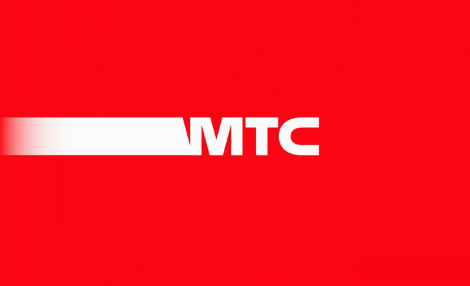](https://moskva.mts.ru/about/media-centr/mediabank/korporativnyj-stil)

**Название ДС:** [Ссылка](https://moskva.mts.ru/about/media-centr/mediabank/korporativnyj-stil)

:book: **Дополнительные ссылки и материалы:**
1.  [Егорова Дарья, МТС – Метод построения экосистемы продуктов](https://www.youtube.com/watch?v=mKJWT2yKgOU)
1.  [Дизайн-система как инструмент экосистемы. Дарья Егорова, МТС](https://www.youtube.com/watch?v=TueI6C9P49g)
1.  [Екатерина Винникова — Дизайн-система МТС —D1e06— MTS Design Community Conference (День 1)](https://www.youtube.com/watch?v=_NlKOVsUYDE)

---

##  [ИТМО](https://itmo.ru/ru/)

[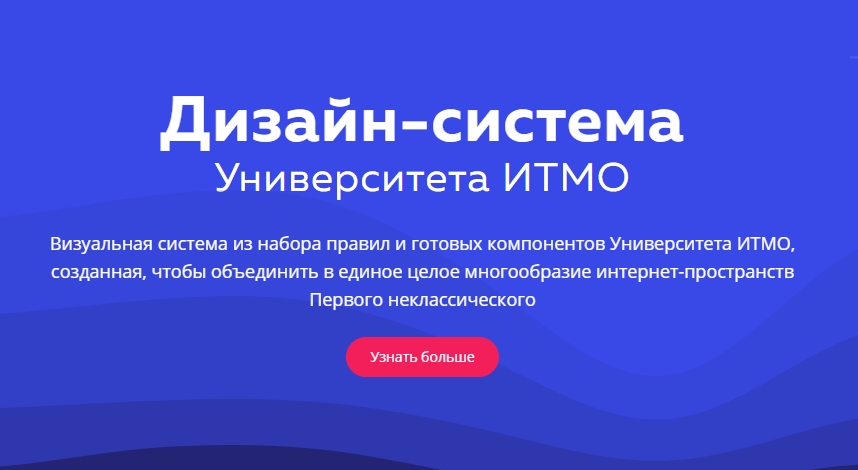](https://design-system.itmo.ru/)

**Название ДС:** [Ссылка](https://design-system.itmo.ru/)

---

##  [ПАО «Газпром нефть»](https://www.gazprom-neft.ru/)

[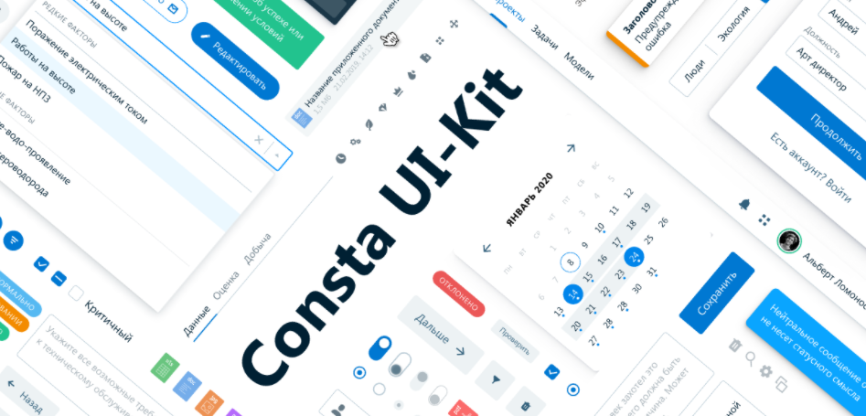](https://consta.gazprom-neft.ru/)

**Название ДС:** [Consta](https://consta.gazprom-neft.ru/) - Дизайн-система технологического лидера нефтегазового рынка России

:book: **Дополнительные ссылки и материалы:**
1.  [Consta](https://github.com/gazprom-neft/consta-uikit) - библиотека компонентов
1. [Дизайн-система Consta](https://consta-uikit.vercel.app)
1.  [Consta в Figma](https://www.figma.com/@consta)
1.  [Chrome 89 и DevTools, релизы и приватность, история веба, цвета из спеки, дизайн-система Consta](https://web-standards.ru/podcast/272/)
1. [Дизайн-система Consta](https://digital.gazprom-neft.ru/about-project?id=consta)

---

##  [Райффайзенбанк](https://www.raiffeisen.ru/)

[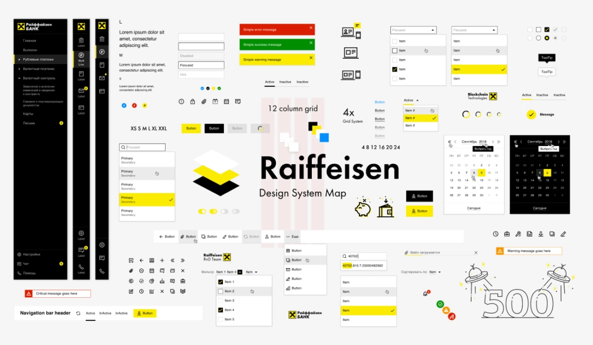](https://raif-brand.ru/)

**Название ДС:** [Vienna](https://raif-brand.ru/) - Дизайн-система одного из заметных российских банков

:book: **Дополнительные ссылки и материалы:**
1.  [ViennaUI](https://github.com/Raiffeisen-DGTL/ViennaUI) - библиотека компонентов
1.  [Прогуляться улочками Vienna: как мы создали свою дизайн-систему](https://vc.ru/design/90566-progulyatsya-ulochkami-vienna-kak-my-sozdali-svoyu-dizayn-sistemu)
1.  [Design System Community Meetup 3/06: видео и материалы встречи](https://habr.com/ru/company/raiffeisenbank/news/t/560180/)
1.  [Бренд- и дизайн-команда Райффайзенбанка](https://www.youtube.com/watch?v=4Hni1ySWLXQ)
1. [Просто и чётко: как и зачем Райффайзенбанк создал собственную бренд-систему](https://www.cossa.ru/special/finance/289639)
1.  [Как быстро создать и безболезненно внедрить большой набор иконок для цифровых продуктов и сервисов: опыт Райффайзенбанка](https://vc.ru/design/195932-kak-bystro-sozdat-i-bezboleznenno-vnedrit-bolshoy-nabor-ikonok-dlya-cifrovyh-produktov-i-servisov-opyt-rayffayzenbanka)

---

##  [Ростелеком](https://rt.ru/)

[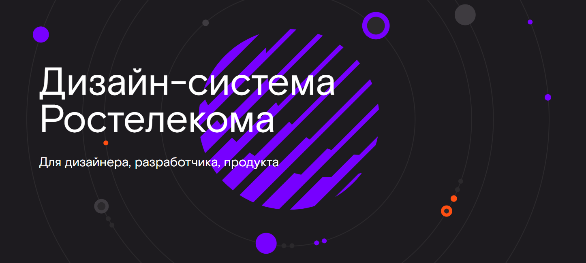](https://design.rt.ru/preview)

**Название ДС:** [Ссылка](https://design.rt.ru/preview) - Один из крупнейших телекоммов

:book: **Дополнительные ссылки и материалы:**
1.  [Свободы и ограничения дизайн-систем](https://habr.com/ru/company/rostelecom/blog/522596/)

---

##  [Сбербанк](https://www.sberbank.ru/)

[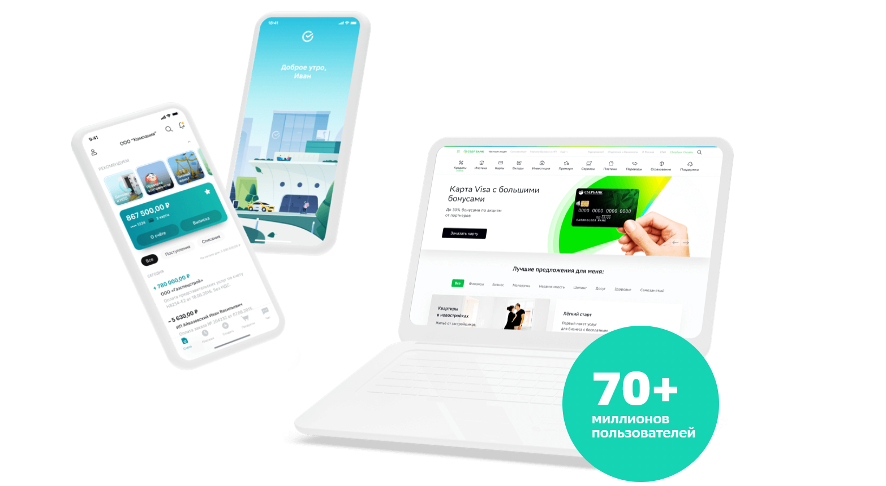](https://www.sberbank.ru/design)

**Название ДС:** [Ссылка](https://www.sberbank.ru/design)

:book: **Дополнительные ссылки и материалы:**
1.  [Сбер – зачем дизайнерам сайт о дизайне. Ярослав Сизов (maildesignfriends)](https://www.youtube.com/watch?v=5vI1mA-fswM)
1.  [Сбер × AIC](https://www.youtube.com/watch?v=pq9dYUGl2EA)

---

##  [Тинькофф](https://www.tinkoff.ru/)

[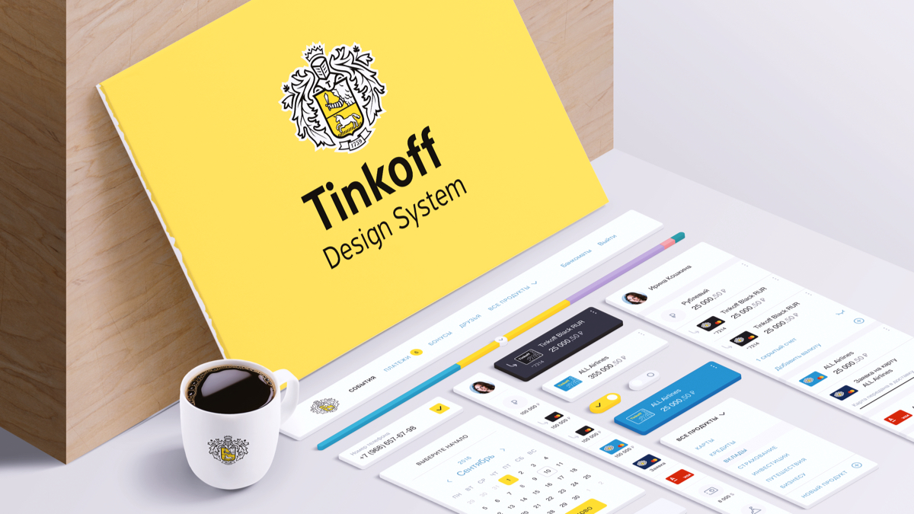](https://taiga-ui.dev/)

**Название ДС:** [Taiga UI](https://taiga-ui.dev/)

:book: **Дополнительные ссылки и материалы:**
1.  [Taiga UI](https://github.com/TinkoffCreditSystems/taiga-ui) - библиотека компонентов
1.  [Создание Tinkoff Design System. Первые шаги](https://habr.com/ru/company/tinkoff/blog/326782/)
1.  [Проблемы React UI Kit-а и единой дизайн-системы, о которых вы не знали](https://habr.com/ru/company/tinkoff/blog/337922/)
1.  [Создание Tinkoff Design System. UI Kit, версионирование и витрина компонентов](https://habr.com/ru/company/tinkoff/blog/339660/)
1.  [Команда Tinkoff – Есть ли дизайн в Тинькофф?](https://www.youtube.com/watch?v=TiarpReoCAU)
1.  [Дизайн-система Tinkoff.ru / Никита Прилепский (Tinkoff.ru)](https://www.youtube.com/watch?v=Jmfa1pCg5a4)
1.  [Дизайн-команда Тинькофф Инвестиции](https://www.youtube.com/watch?v=0cL1KebEi4Y)

---

##  [Яндекс](https://www.yandex.ru/)

**Название ДС:** [БЭМ](https://ru.bem.info/) - Платформа от создателей БЭМ для унификации продуктов компании

:book: **Дополнительные ссылки и материалы:**
1.  [BEM](https://github.com/bemdesign) - библиотека компонентов
1.  [Прототипирование на продакшн-технологиях](https://habr.com/ru/company/yoomoney/blog/341028/)
1.  [БЭМ-методология: с чего всё начиналось и зачем это всё нужно](https://habr.com/ru/company/yandex/blog/276035/)
1. [БЭМ](https://yandex.ru/dev/bem/)

---

##  [B2B-Center](https://www.b2b-center.ru)

[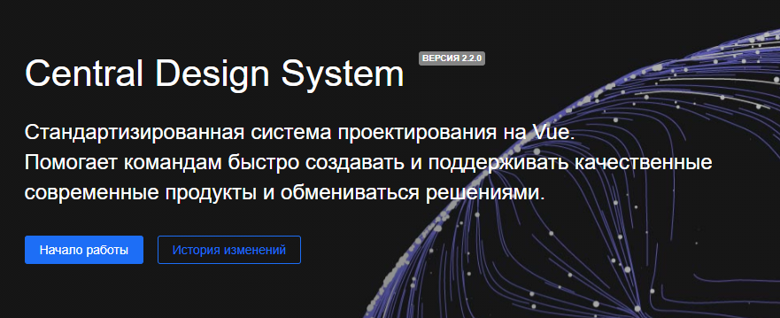](https://cds.b2b-center.ru/)

**Название ДС:** [Central Design System](https://cds.b2b-center.ru/) - Отечественная площадка торгов для бизнеса

---

##  [Delivery Club](https://www.delivery-club.ru/moscow)

[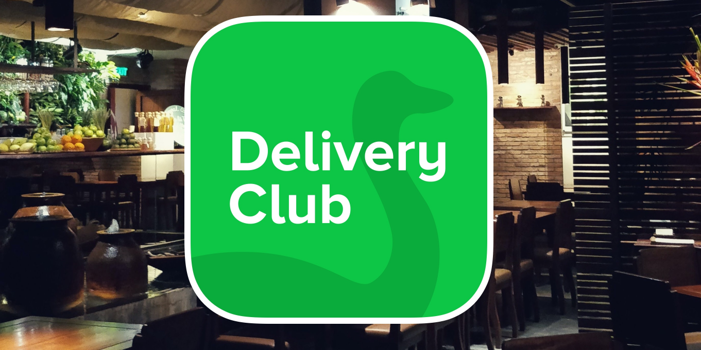](http://delivery-club.design/)

**Название ДС:** [Walrus Kit](http://delivery-club.design/)

:book: **Дополнительные ссылки и материалы:**
1.  [Реализуем работу со шрифтами для дизайн-системы | Скринкасты | Delivery Club | #1](https://www.youtube.com/watch?v=FqQaV0A6GGc)

---

##  [Discord](https://discord.com/)

[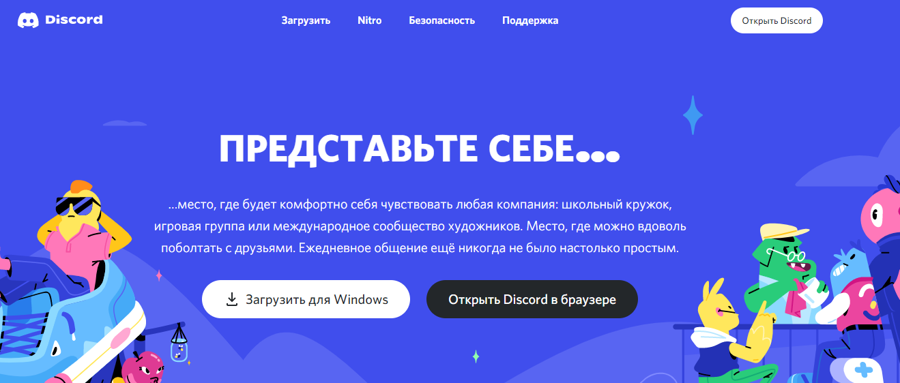](https://discord.com/brand-new/branding)

**Название ДС:** [Ссылка](https://discord.com/brand-new/branding)

:book: **Дополнительные ссылки и материалы:**
1. [Новый облик к нашему 6-му дню рождения](https://support.discord.com/hc/ru/articles/1500009438682-Новый-облик-к-нашему-6-му-дню-рождения)

---

##  [IVI](https://www.ivi.ru/)

[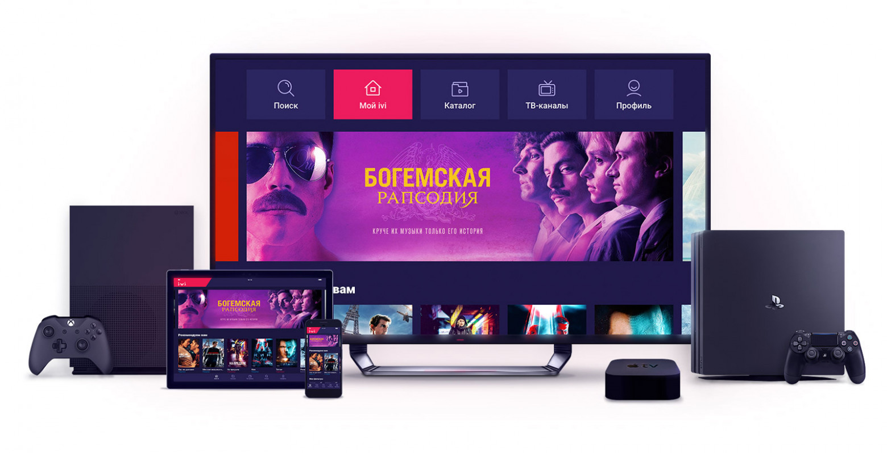](https://design.ivi.ru/)

**Название ДС:** [Ссылка](https://design.ivi.ru/) - Кросплатформенная версия дизайн-системы от команды онлайн-кинотеатра

:book: **Дополнительные ссылки и материалы:**
1.  [Статьи и доклады](https://design.ivi.ru/links/)

---

##  [Mail.Ru Group](https://mail.ru/)

**Название ДС:** [Paradigm](https://design.mail.ru/) - Портальная дизайн-команда постепенно унифицирует продукты

:book: **Дополнительные ссылки и материалы:**
1.  [UX-стратегия на практике. Часть 1 — Фреймворк](https://jvetrau.com/uxstrategy-1/)
1.  [UX-стратегия на практике. Часть 2 — Продуктовый дизайнер](https://jvetrau.com/uxstrategy-2/)
1.  [UX-стратегия на практике. Часть 3 — Платформенное мышление](https://jvetrau.com/uxstrategy-3/)
1.  [Унификация дизайна: Фреймворк Mail.Ru Group для мобильного веба](https://jvetrau.com/unification-1/)
1.  [Paradigm — дизайн-система Mail.Ru Group, часть 1: визуальный язык](https://habr.com/ru/company/mailru/blog/333510/)
1.  [Зубанов Костя – Развитие дизайн-системы Mail.ru Paradigm](https://www.youtube.com/watch?v=wocb6FHZ0Bw)
1.  [Paradigm 2.0 — как мы переосмыслили дизайн-систему Mail.ru](https://vc.ru/design/250151-paradigm-2-0-kak-my-pereosmyslili-dizayn-sistemu-mail-ru)

---

##  [Ozon](https://www.ozon.ru/)

[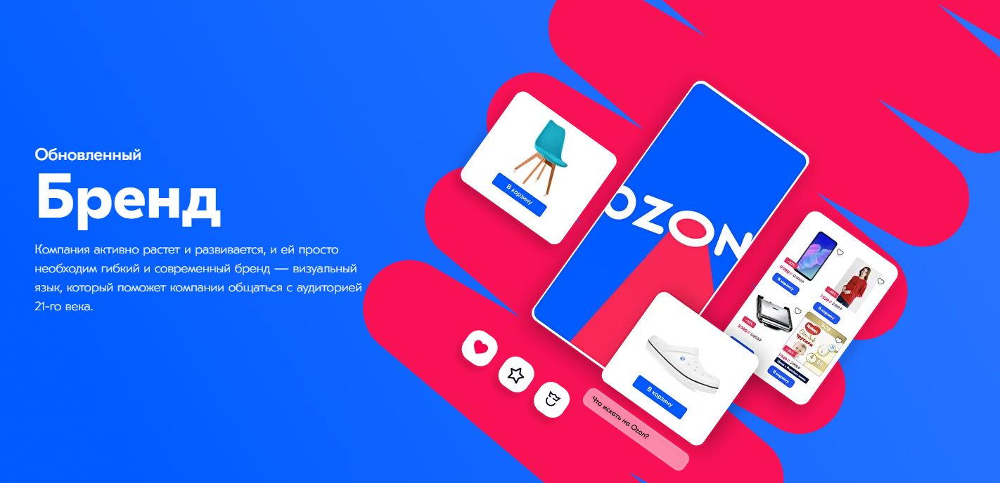](https://corp.ozon.ru/mediakit)

**Название ДС:** [Mediakit](https://corp.ozon.ru/mediakit)

:book: **Дополнительные ссылки и материалы:**
1.  [Быстрый запуск фичей с Server Driven UI | Александр Свиридов, Ozon](https://www.youtube.com/watch?v=RYQyA4VmnJo)
1.  [Backend-Driven UI – Алексей Новиков](https://www.youtube.com/watch?v=NguVmJ3HyrA)

---

##  [Rambler Group](https://www.rambler.ru/)

[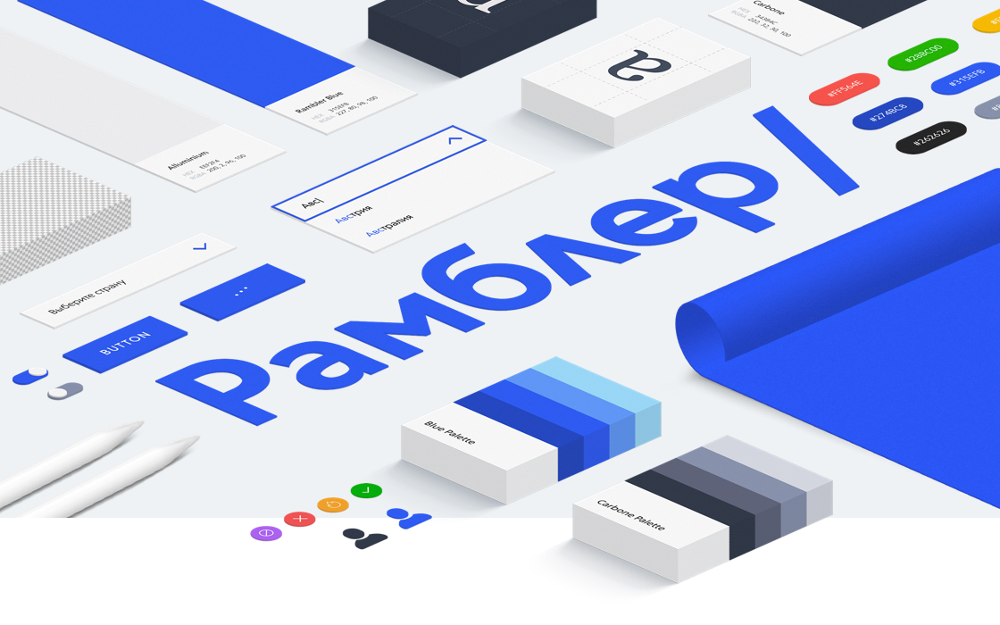](https://ui-kit.rambler.ru)

**Название ДС:** [Ratio](https://ui-kit.rambler.ru) - Дизайн-команда одного из крупнейших отечественных порталов

:book: **Дополнительные ссылки и материалы:**
1.  [Rambler UI](https://github.com/rambler-digital-solutions/rambler-ui) - библиотека компонентов
1.  [Бренд Рамблера](https://brand.rambler.ru/)
1.  [Разработка единой дизайн-системы — опыт «Рамблера»](https://vc.ru/design/28213-razrabotka-edinoy-dizayn-sistemy-opyt-ramblera)

---

##  [Semrush](https://ru.semrush.com/)

[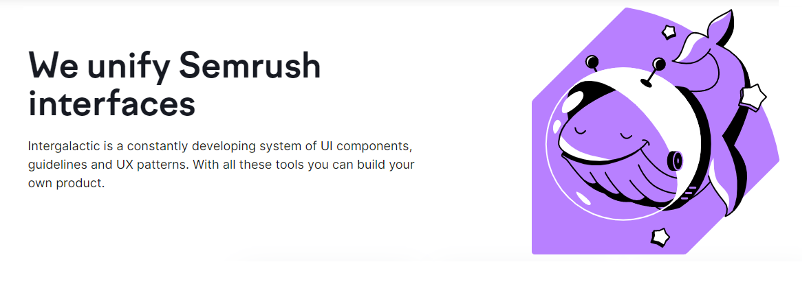](https://i.semrush.com/)

**Название ДС:** [Intergalactic](https://i.semrush.com/) - Глобальная онлайн-платформа для интернет-маркетологов

:book: **Дополнительные ссылки и материалы:**
1.  [Intergalactic](https://github.com/semrush/intergalactic) - библиотека компонентов
1.  [Semrush в Figma](https://www.figma.com/@semrush)
1.  [Юлия Мнижек - Не кричи на меня! Как успокоить интерфейс? | GeekPicnic 2019 | HARD IT](https://www.youtube.com/watch?v=RFSeAIM7HM8)
1.  [О дизайн-системе Семраш с Антоном Дуканичем](https://www.youtube.com/watch?v=CoN82sBhCqQ)
1.  [Как переехать со Sketch на Figma. Опыт Semrush](https://vc.ru/semrush/239438-kak-pereehat-so-sketch-na-figma-opyt-semrush)

---

##  [QIWI](https://qiwi.com/)

[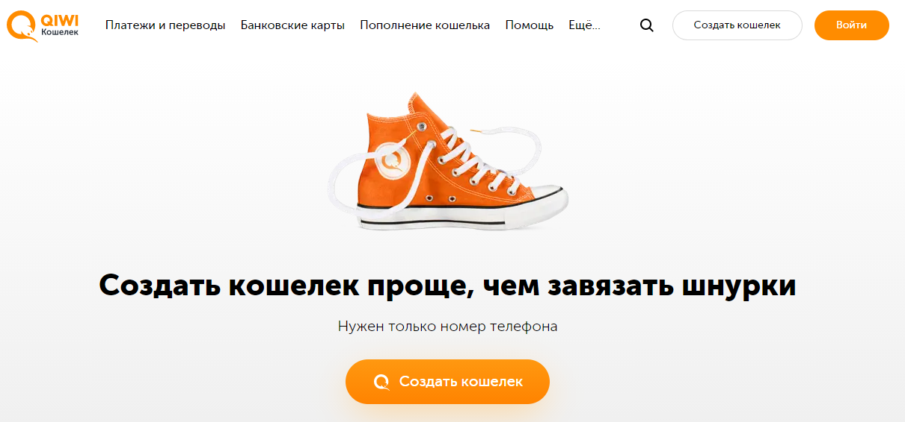](http://qiwiguide.ru/)

**Название ДС:** [QIWI Guide](http://qiwiguide.ru/)

:book: **Дополнительные ссылки и материалы:**
1.  [Переход от UI-кита к дизайн-системе в QIWI](https://habr.com/ru/company/qiwi/blog/433780/)

---

## Контрибьюторы

[Содержание](#содержание)

Этот проект существует благодаря всем людям, которые вносят свой вклад:

Если у вас есть желание помочь с наполнением или актуализацией этого репозитория, пожалуйста, ознакомьтесь с информацией в файле [CONTRIBUTING.md](CONTRIBUTING.md).

---

> Автор: [Николай Чеботов (**Unchase**)](https://github.com/unchase)   

 Это произведение доступно по <a rel="license" href="http://creativecommons.org/licenses/by/4.0/">лицензии Creative Commons «Attribution» («Атрибуция») 4.0 Всемирная</a>.
